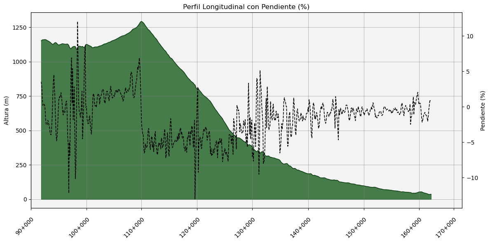

# Profile & Slope Plotter

Notebook **Jupyter** para generar **perfiles longitudinales** y **gráficas de pendiente (%)** a partir de un fichero **CSV**. Se diseñó inicialmente para trabajar con salidas de [L-RAT](https://github.com/Javisionario/L-RAT), aunque puede utilizarse con cualquier tabla o dataset que contenga los campos esperados.

Está pensado para flujos típicos de **ingeniería civil** (carreteras, ferrocarril, conducciones y trazados lineales), pero es aplicable a cualquier serie con eje longitudinal (distancia) y variables asociadas.

---

## 🎯 Qué hace este notebook

- Genera **dos figuras**:
  - ✅ Perfil longitudinal (cota vs distancia)
  - ✅ Perfil longitudinal + **pendiente (%)** en eje secundario
- El eje X siempre se representa contra **`Dist_Origen_metros`** (distancia real en metros).
- Permite elegir cómo etiquetar el eje X:
  - **PK (K+MMM)** usando `m_field_PK_KM`
  - **Metros** usando `Dist_Origen_metros`
- Estilo gráfico homogéneo preparado para informes.

---

## 📥 Input

Un CSV que debe incluir, como mínimo, estas columnas:

| Campo | Tipo | Descripción |
|------|------|-------------|
| `Dist_Origen_metros` | float | Distancia acumulada (m). Se usa como eje X real |
| `Cota_SUAV` | float | Cota/elevación suavizada (m) |
| `SLOPE` | float | Pendiente (%) |
| `m_field_PK_KM` | float | PK en kilómetros (ej. 162.300) |

**Notas:**
- El notebook ordena los datos por `Dist_Origen_metros` y puede colapsar duplicados para evitar artefactos en el relleno del perfil.
- `SLOPE` puede contener `NaN` sin impedir el gráfico del perfil.

---

## 🧩 Salida y estilo

- Perfil con área rellena y línea de perfil.
- En la segunda figura:
  - eje Y izquierdo: **Altura (m)**
  - eje Y derecho: **Pendiente (%)**
- Guías verticales y horizontales con estilo uniforme.
- Fondo del área de trazado con gris semitransparente.

---

## ⚠️ Notas técnicas

La conversión **PK → X** usa interpolación y extrapolación robusta y controla:

- PK duplicados (se promedian)
- pequeñas variaciones en la distancia si los PKs no están correctamente calibrados
- posicionamiento correcto de ticks fuera del rango observado

Esto permite ubicar correctamente ticks fuera del dataset pero necesarios para una visualización elegante del gráfico.

---

## 📄 Licencia

Este proyecto se distribuye bajo la **GNU General Public License v3.0 (GPL-3.0)**.
Puedes usarlo, modificarlo y compartirlo libremente bajo los términos de esta licencia.

---

## 👤 Autor

- **LinkedIn**: [Javi H. Piris](https://www.linkedin.com/in/javierhpiris)
- **GitHub**: [@Javisionario](https://github.com/Javisionario)
